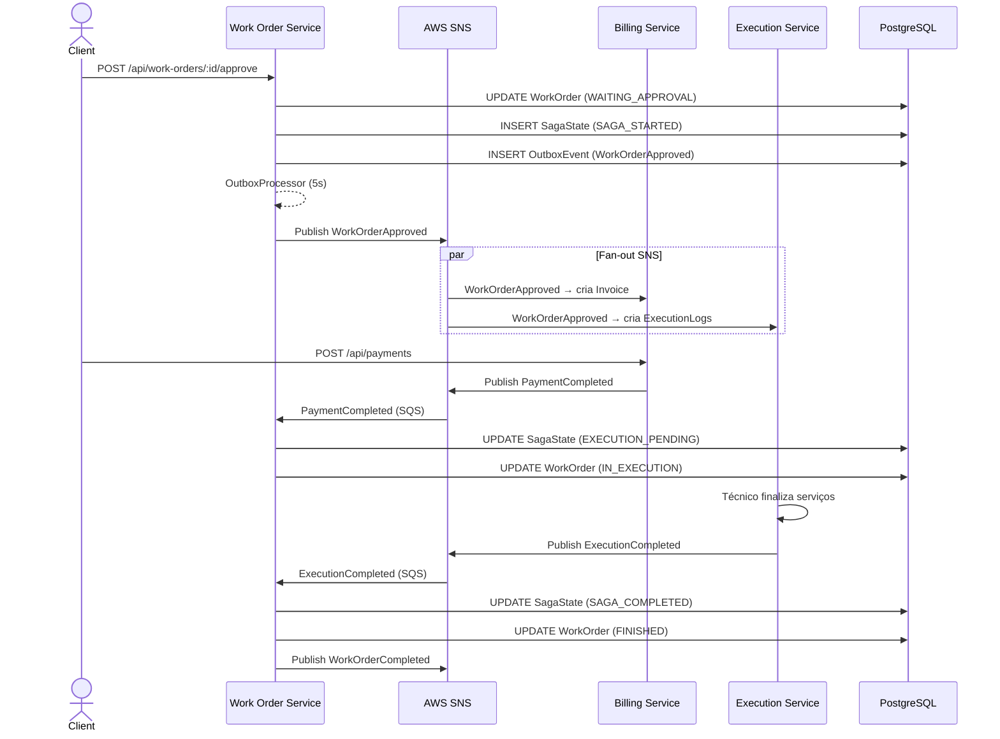
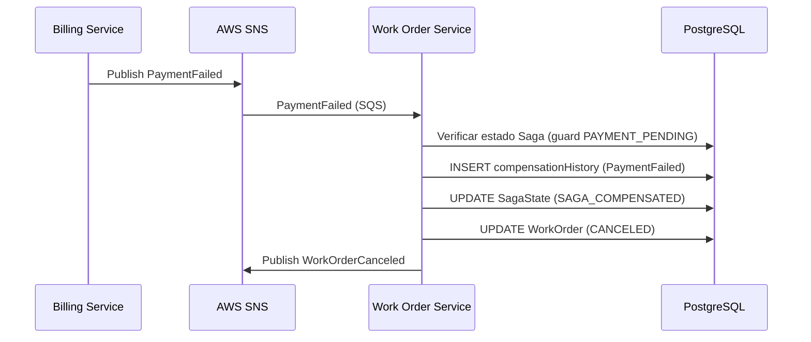
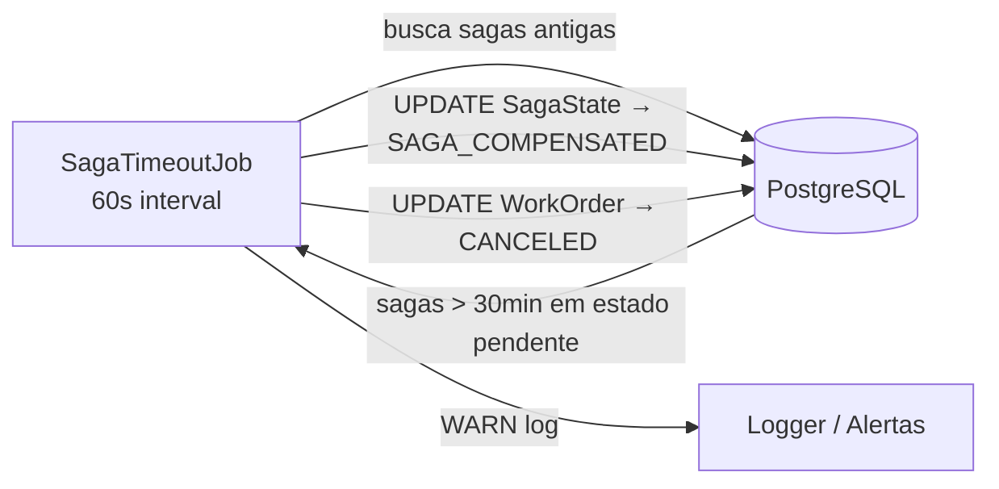

# Work Order Service

> Orquestrador central do sistema — gerencia o ciclo de vida das ordens de serviço e coordena o fluxo entre pagamento e execução via Saga Pattern.

## Sumário

- [1. Visão Geral](#1-visão-geral)
- [2. Arquitetura](#2-arquitetura)
- [3. Tecnologias Utilizadas](#3-tecnologias-utilizadas)
- [4. Comunicação entre Serviços](#4-comunicação-entre-serviços)
- [5. Diagramas](#5-diagramas)
- [6. Execução e Setup](#6-execução-e-setup)
- [7. Pontos de Atenção](#7-pontos-de-atenção)
- [8. Boas Práticas e Padrões](#8-boas-práticas-e-padrões)

---

## 1. Visão Geral

### Propósito

O **Work Order Service** é o núcleo do sistema de oficina automotiva. Ele é responsável por:

1. **Gerenciar o catálogo** de serviços e peças/suprimentos
2. **Orquestrar o ciclo de vida das ordens de serviço (OS)** — desde a criação até a entrega
3. **Coordenar a Saga** entre Billing Service e Execution Service usando Saga Orchestration Pattern
4. **Persistir e expor o estado da Saga** para rastreabilidade e diagnóstico

### Problema que Resolve

Sem um orquestrador, cada microserviço precisaria conhecer os demais e reagir a eventos de forma coreografada, aumentando o acoplamento e dificultando o rastreamento de falhas. Este serviço centraliza a lógica de coordenação:

- Define explicitamente as transições válidas da Saga
- Implementa compensações automáticas em caso de falha (pagamento ou execução)
- Detecta e resolve timeouts de Saga via job periódico

### Papel na Arquitetura

| Papel                 | Descrição                                                      |
| --------------------- | -------------------------------------------------------------- |
| **Saga Orchestrator** | Coordena Billing e Execution Services via eventos assíncronos  |
| **Domain Service**    | Gerencia catálogo de serviços, peças e ordens de serviço       |
| **Event Producer**    | Publica eventos de OS via SNS (fan-out para todos os serviços) |
| **Event Consumer**    | Consome eventos de pagamento e execução para atualizar a Saga  |
| **API REST**          | Expõe CRUD completo de OS, serviços, peças e estado da Saga    |

---

## 2. Arquitetura

### Clean Architecture + Saga Orchestration

O serviço adota **Clean Architecture** com um módulo dedicado para a Saga:

```
src/
├── domain/
│   ├── entities/         # WorkOrder, SagaState, Service, PartOrSupply
│   ├── enums/            # Status (OS), SagaStatus
│   ├── events/           # DomainEvent, EventType, WorkOrderEventData...
│   └── use-cases/
│       ├── work-order/   # CRUD de ordens de serviço
│       ├── saga/         # StartSaga, UpdateSagaStep, GetSagaState
│       ├── service/      # CRUD de serviços
│       └── part-or-supply/ # CRUD de peças
├── application/          # Implementações dos use cases
├── infra/
│   ├── db/               # Prisma client, repositórios, mappers
│   ├── messaging/
│   │   ├── saga-event-handler.ts   # Lógica central da Saga
│   │   ├── saga-timeout-job.ts     # Job de timeout (30min)
│   │   ├── outbox-processor.ts     # Outbox polling
│   │   └── dlq-monitor.ts
│   ├── circuit-breaker.ts
│   └── observability/
├── presentation/         # Controllers Fastify
└── main/                 # Composition root
```

### Saga State Machine

A Saga é uma máquina de estados finitos que garante consistência entre os serviços:

```
                                        ┌─────────────────┐
                                        │  SAGA_STARTED   │
                                        └────────┬────────┘
                                                 │ WorkOrderApproved
                                                 ▼
                                        ┌─────────────────┐
                                        │ PAYMENT_PENDING │
                                        └────────┬────────┘
                              ┌──────────────────┤
                 PaymentFailed│                  │ PaymentCompleted
                              ▼                  ▼
                   ┌──────────────────┐ ┌─────────────────────┐
                   │ SAGA_COMPENSATED │ │  EXECUTION_PENDING  │
                   └──────────────────┘ └──────────┬──────────┘
                                   ┌───────────────┤
                      ExecutionFailed│              │ ExecutionCompleted
                                   ▼               ▼
                         ┌──────────────────┐ ┌─────────────────┐
                         │ SAGA_COMPENSATED │ │ SAGA_COMPLETED  │
                         └──────────────────┘ └─────────────────┘
```

### Decisões Arquiteturais

| Decisão                                  | Justificativa                                                                                                        | Trade-off                                                               |
| ---------------------------------------- | -------------------------------------------------------------------------------------------------------------------- | ----------------------------------------------------------------------- |
| **Saga Orchestration** (vs Choreography) | Estado centralizado, rastreabilidade, compensações explícitas                                                        | Acoplamento ao orquestrador; ponto único de falha se não monitorado     |
| **Guard de transição de estado**         | Só processa evento se a Saga está no estado válido esperado (ex.: `PaymentCompleted` só aceita de `PAYMENT_PENDING`) | Eventos fora de ordem são silenciosamente ignorados                     |
| **Histórico de compensação**             | Todas as compensações são registradas com timestamp e motivo em JSON                                                 | Overhead de armazenamento; não substituível por logs externos           |
| **Outbox Pattern**                       | Garante at-least-once delivery dos eventos SNS                                                                       | Latência de ~5s; Prisma transactions garantem atomicidade outbox+evento |
| **Saga Timeout Job**                     | Cancela sagas presas em estados intermediários após 30min                                                            | Timeout fixo pode não ser adequado para todos os cenários               |

---

## 3. Tecnologias Utilizadas

| Tecnologia        | Versão | Propósito                                                      |
| ----------------- | ------ | -------------------------------------------------------------- |
| **Node.js**       | 22     | Runtime                                                        |
| **TypeScript**    | 5.9    | Linguagem                                                      |
| **Fastify**       | 5.2    | Framework HTTP                                                 |
| **Prisma**        | 7      | ORM — WorkOrder, Service, PartOrSupply, SagaState, OutboxEvent |
| **PostgreSQL**    | 16     | Banco de dados relacional                                      |
| **AWS SNS**       | SDK v3 | Publicação de eventos de OS                                    |
| **AWS SQS**       | SDK v3 | Consumo de eventos de pagamento e execução                     |
| **Zod**           | 4      | Validação de schemas                                           |
| **OpenTelemetry** | 1.x    | Rastreamento distribuído e métricas                            |
| **Jest**          | 30     | Testes unitários e BDD                                         |
| **jest-cucumber** | 4      | Testes BDD (cenários .feature)                                 |

**Infraestrutura**: AWS (SNS, SQS), PostgreSQL (RDS em produção), EKS, ECR.

---

## 4. Comunicação entre Serviços

### Eventos Consumidos (SQS)

| Fila                         | Evento               | Ação da Saga                                                            |
| ---------------------------- | -------------------- | ----------------------------------------------------------------------- |
| `work-order-payment-queue`   | `PaymentCompleted`   | Saga → `EXECUTION_PENDING`; OS → `IN_EXECUTION`; publica para Execution |
| `work-order-payment-queue`   | `PaymentFailed`      | Saga → `SAGA_COMPENSATED`; OS → `CANCELED`                              |
| `work-order-execution-queue` | `ExecutionCompleted` | Saga → `SAGA_COMPLETED`; OS → `FINISHED`                                |
| `work-order-execution-queue` | `ExecutionFailed`    | Publica `RefundRequested`; Saga → `SAGA_COMPENSATED`; OS → `CANCELED`   |

### Eventos Publicados (SNS)

| Tópico              | Evento               | Gatilho                                                            |
| ------------------- | -------------------- | ------------------------------------------------------------------ |
| `work-order-events` | `WorkOrderApproved`  | OS aprovada via `POST /api/work-orders/:id/approve`                |
| `work-order-events` | `WorkOrderCanceled`  | OS cancelada via `POST /api/work-orders/:id/cancel` ou compensação |
| `work-order-events` | `RefundRequested`    | ExecutionFailed → solicita estorno ao Billing                      |
| `work-order-events` | `WorkOrderCompleted` | ExecutionCompleted → notifica conclusão                            |

### Endpoints REST

| Método                | Rota                           | Descrição                 | Auth    |
| --------------------- | ------------------------------ | ------------------------- | ------- |
| `POST`                | `/api/work-orders`             | Criar OS                  | JWT     |
| `GET`                 | `/api/work-orders`             | Listar OS                 | JWT     |
| `GET`                 | `/api/work-orders/:id`         | Buscar OS por ID          | JWT     |
| `PUT`                 | `/api/work-orders/:id`         | Atualizar OS              | JWT     |
| `DELETE`              | `/api/work-orders/:id`         | Remover OS                | JWT     |
| `POST`                | `/api/work-orders/:id/approve` | Aprovar OS (inicia Saga)  | JWT     |
| `POST`                | `/api/work-orders/:id/cancel`  | Cancelar OS               | JWT     |
| `GET`                 | `/api/sagas/:workOrderId`      | Estado atual da Saga      | JWT     |
| `POST/GET/PUT/DELETE` | `/api/services`                | CRUD de serviços          | JWT     |
| `POST/GET/PUT/DELETE` | `/api/parts-or-supplies`       | CRUD de peças/suprimentos | JWT     |
| `GET`                 | `/health`                      | Health check              | Público |

---

## 5. Diagramas

### Fluxo Completo da Saga



### Fluxo de Compensação (Falha de Pagamento)



### Saga Timeout Job



---

## 6. Execução e Setup

### Pré-requisitos

- Node.js 22+, Yarn 1.22+
- PostgreSQL 16 (ou via Docker Compose)
- AWS CLI configurado (ou MiniStack)
- Variáveis de ambiente configuradas

### Rodando Localmente

```bash
# Instalar dependências
yarn install

# Gerar o Prisma Client
yarn prisma:generate

# Rodar migrações
yarn prisma:migrate

# Iniciar em modo desenvolvimento
yarn dev

# Build para produção
yarn build && yarn start
```

### Via Docker Compose

```bash
docker compose up -d --build
docker compose logs -f
docker compose down -v
```

### Variáveis de Ambiente

Copie `.env.example` para `.env` e preencha:

| Variável                      | Descrição                               | Obrigatório           |
| ----------------------------- | --------------------------------------- | --------------------- |
| `SERVER_PORT`                 | Porta HTTP do serviço                   | Sim (default: `3002`) |
| `DATABASE_URL`                | Connection string PostgreSQL            | Sim                   |
| `AWS_REGION`                  | Região AWS                              | Sim                   |
| `AWS_ENDPOINT`                | Endpoint LocalStack/MiniStack (só dev)  | Não                   |
| `SNS_WORK_ORDER_TOPIC_ARN`    | ARN do tópico SNS de ordens de serviço  | Sim                   |
| `SQS_PAYMENT_QUEUE_URL`       | URL da fila SQS de eventos de pagamento | Sim                   |
| `SQS_EXECUTION_QUEUE_URL`     | URL da fila SQS de eventos de execução  | Sim                   |
| `JWT_ACCESS_TOKEN_SECRET`     | Chave de verificação JWT                | Sim                   |
| `OTEL_EXPORTER_OTLP_ENDPOINT` | Endpoint do OTel Collector              | Não                   |
| `LOG_LEVEL`                   | Nível de log                            | Não (default: `info`) |

### Testes

```bash
# Unitários (use cases, saga handler, event handler)
yarn test

# BDD / E2E (requer ambiente completo rodando)
yarn test:e2e

# Com cobertura
yarn test --coverage
```

---

## 7. Pontos de Atenção

### Guard de Transição de Estado

O `SagaEventHandler` verifica se a Saga está no estado válido antes de processar qualquer evento. Ex.: `PaymentCompleted` só é aceito se o estado for `PAYMENT_PENDING` ou `SAGA_STARTED`. Eventos fora de ordem são ignorados com log de `warn`. Isso evita corridas de condição mas pode ocultar problemas de ordenação real em produção.

### Idempotência com Transação Prisma

O `SagaEventHandler` usa `prisma.$transaction` para verificar e registrar o `ProcessedEvent` atomicamente junto com a atualização de estado. Isso é mais seguro do que o DynamoDB Outbox do billing-service, pois garante atomicidade real entre o processamento e o registro.

### Saga Timeout Job

O job roda a cada 60 segundos e cancela sagas com mais de 30 minutos em estados intermediários (`SAGA_STARTED`, `PAYMENT_PENDING`, `EXECUTION_PENDING`). O timeout é um valor fixo — ajuste conforme o SLA esperado para pagamento e execução. Sagas compensadas são registradas com histórico detalhado.

### Compensação e Refund

Quando `ExecutionFailed`, o serviço publica `RefundRequested` para que o Billing Service processe o estorno. O Work Order Service **não processa o estorno diretamente** — apenas sinaliza a necessidade via evento.

### Outbox e Atomicidade

O Outbox usa Prisma com PostgreSQL, garantindo que o evento seja persistido na mesma transação do update de estado. O `OutboxProcessor` faz polling a cada 5s e publica no SNS. Em falha do processor, eventos ficam pendentes no banco e são publicados na próxima execução.

---

## 8. Boas Práticas e Padrões

### Segurança

- **JWT obrigatório** em todos os endpoints (exceto `/health`)
- **@fastify/helmet**, **@fastify/rate-limit**, **@fastify/cors** habilitados
- Secrets AWS e JWT via variáveis de ambiente

### Validação

- Schemas **Zod** em todas as rotas; erros retornam `400` estruturado

### Logging e Observabilidade

- Logger **Pino** com JSON estruturado e request ID
- **OpenTelemetry** → OTLP → Prometheus → Grafana
- Métricas: `work_orders_completed`, `saga_compensated`, `saga_completed`
- Contadores definidos em `src/infra/observability/metrics.ts`

### Tratamento de Erros

- Erros de infraestrutura capturados e logados sem expor ao cliente
- Circuit Breaker protege SNS
- DLQ Monitor alerta sobre mensagens não processadas

### Testes BDD

- Testes E2E com `jest-cucumber` descrevem cenários completos da Saga em arquivos `.feature`
- Cobertura mínima: 80% em branches, functions, lines e statements

## Saga Pattern

Este serviço é o **orquestrador central do Saga**, coordenando o fluxo de trabalho entre os microserviços Billing e Execution.

### Estados da Saga

```
SAGA_STARTED → PAYMENT_PENDING → PAYMENT_COMPLETED → EXECUTION_PENDING → EXECUTION_COMPLETED → SAGA_COMPLETED
                                → PAYMENT_FAILED    → SAGA_COMPENSATING → SAGA_COMPENSATED
                                                      EXECUTION_FAILED  → SAGA_COMPENSATING → SAGA_COMPENSATED
```

### Fluxo de Eventos

1. **Aprovação da OS** → Publica `WorkOrderApproved` via SNS
2. **Billing Service** processa pagamento → Publica `PaymentCompleted` ou `PaymentFailed`
3. **Work Order Service** recebe evento e transiciona saga:
   - `PaymentCompleted` → atualiza saga para `EXECUTION_PENDING`, OS para `IN_EXECUTION`
   - `PaymentFailed` → compensa saga, cancela OS
4. **Execution Service** executa → Publica `ExecutionCompleted` ou `ExecutionFailed`
5. **Work Order Service** finaliza:
   - `ExecutionCompleted` → saga `SAGA_COMPLETED`, OS `FINISHED`
   - `ExecutionFailed` → publica `RefundRequested`, compensa saga, cancela OS

### Idempotência e Tolerância a Falhas

- **Deduplicação por `eventId`**: eventos duplicados são ignorados
- **Guard de transição de estado**: só processa eventos se a saga está no estado válido esperado
- **Histórico de compensação**: todas as compensações são registradas com timestamp e motivo

## Endpoints

| Método              | Rota                           | Descrição                |
| ------------------- | ------------------------------ | ------------------------ |
| POST                | `/api/work-orders`             | Criar OS                 |
| GET                 | `/api/work-orders`             | Listar OS                |
| GET                 | `/api/work-orders/:id`         | Buscar OS por ID         |
| PUT                 | `/api/work-orders/:id`         | Atualizar OS             |
| DELETE              | `/api/work-orders/:id`         | Remover OS               |
| POST                | `/api/work-orders/:id/approve` | Aprovar OS (inicia Saga) |
| POST                | `/api/work-orders/:id/cancel`  | Cancelar OS              |
| GET                 | `/api/sagas/:workOrderId`      | Consultar estado da Saga |
| POST/GET/PUT/DELETE | `/api/services`                | CRUD de serviços         |
| POST/GET/PUT/DELETE | `/api/parts-or-supplies`       | CRUD de peças            |

## Variáveis de Ambiente

| Variável                   | Descrição                 | Padrão    |
| -------------------------- | ------------------------- | --------- |
| `SERVER_PORT`              | Porta do servidor         | 3002      |
| `DATABASE_URL`             | URL PostgreSQL            | —         |
| `AWS_REGION`               | Região AWS                | us-east-1 |
| `AWS_ENDPOINT`             | Endpoint LocalStack (dev) | —         |
| `SNS_WORK_ORDER_TOPIC_ARN` | ARN do tópico SNS         | —         |
| `SQS_PAYMENT_QUEUE_URL`    | URL da fila de pagamentos | —         |
| `SQS_EXECUTION_QUEUE_URL`  | URL da fila de execução   | —         |
| `CORS_ORIGIN`              | Origem CORS permitida     | `*`       |

## Execução Local

```bash
yarn install
yarn prisma generate
yarn prisma migrate dev
yarn start:dev
```

## Testes

```bash
yarn test          # Unitários (28 suites, 102 testes)
yarn test:e2e      # BDD/E2E com jest-cucumber (requer ambiente local rodando)
```

- Cobertura mínima: 80%
- BDD: 6 cenários cobrindo fluxo completo da Saga

## Docker

```bash
docker compose up -d
```

## CI/CD

Pipeline GitHub Actions: lint → test → build → push ECR → deploy EKS
